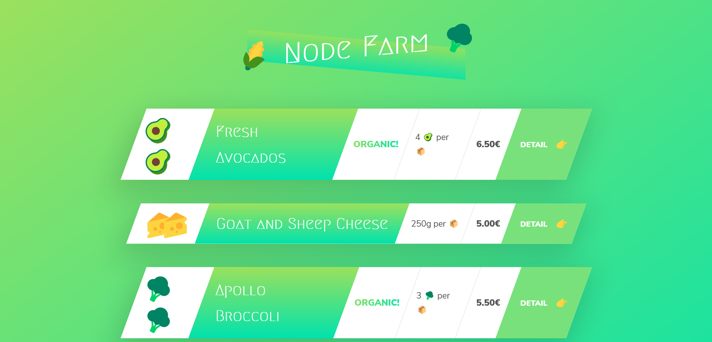

# Node Farm

### UDEMY COURSE

Taught by [Jonash Schmedtmann](https://www.udemy.com/course/the-complete-javascript-course/#instructor-1)

## Purpose

I'm using this Udemy Course to deepen my understanding of Backend Web Development by creating projects with Node.js, Express, and MongoDB. This is the first project in the course. Once I complete this project I will design and implement my own Web App using what I've learned here.

## Table of Contents

- [Author](#author)
- [Usage](#Usage)
- [About Me](#about me)
- [Badges](#badges)

## Author

[Jonash Schmedtmann](https://www.udemy.com/course/the-complete-javascript-course/#instructor-1) is the author and creator of this project. I took this course on [Udemy](https://www.udemy.com/).

## Usage

To use this app download the source code, using the console navigate to the projects root directory, run npm i, then node index.js. You'll receive a notification in the console stating "Listening to requests on port 8000". Open up Chrome and type localhost:8000 in your browser. BOOM! You'll be greeted with the app image.

## About Me

Hello! My name is David. 
Email is dwhipp88@gmail.com.  
[LinkedIn](https://www.linkedin.com/in/david-w-079841213/)  
If you're interested in seeing more of my work then check out my [portfolio](http://mighty-brook-32674.herokuapp.com/) or you can view my [github](https://github.com/D-Whipp).

## Badges

